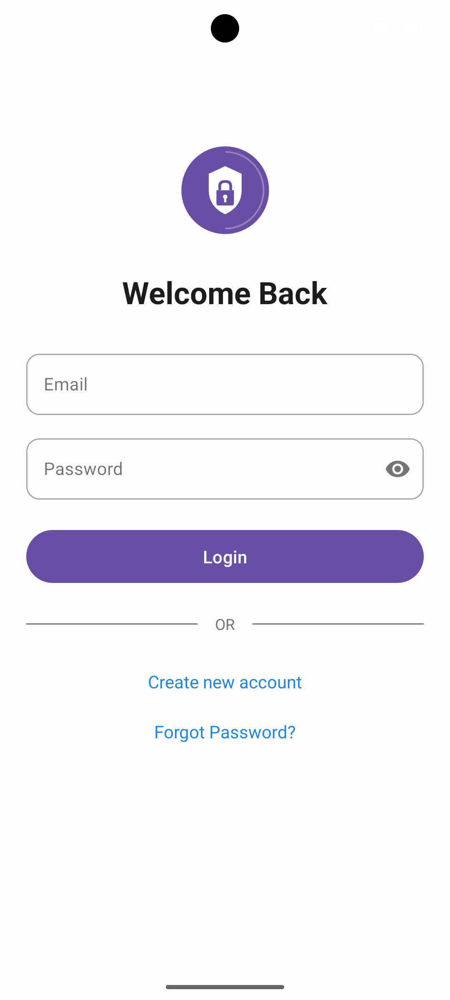
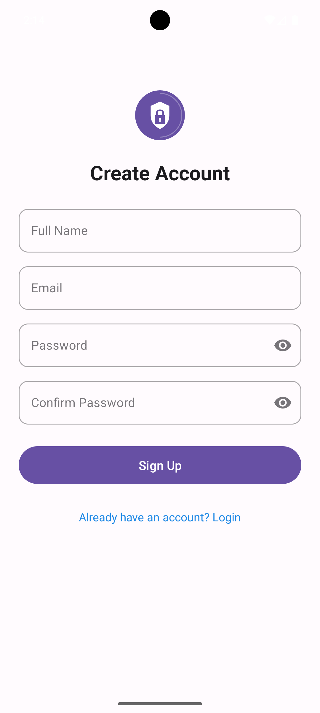
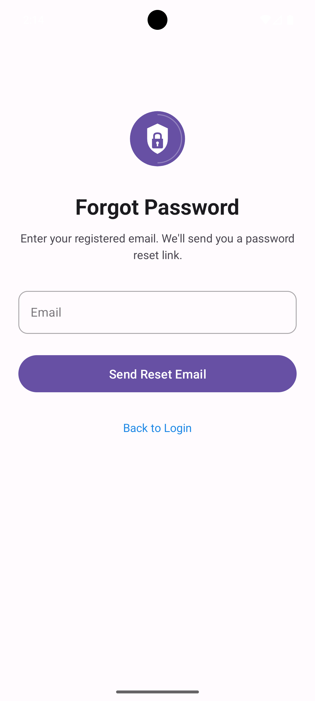
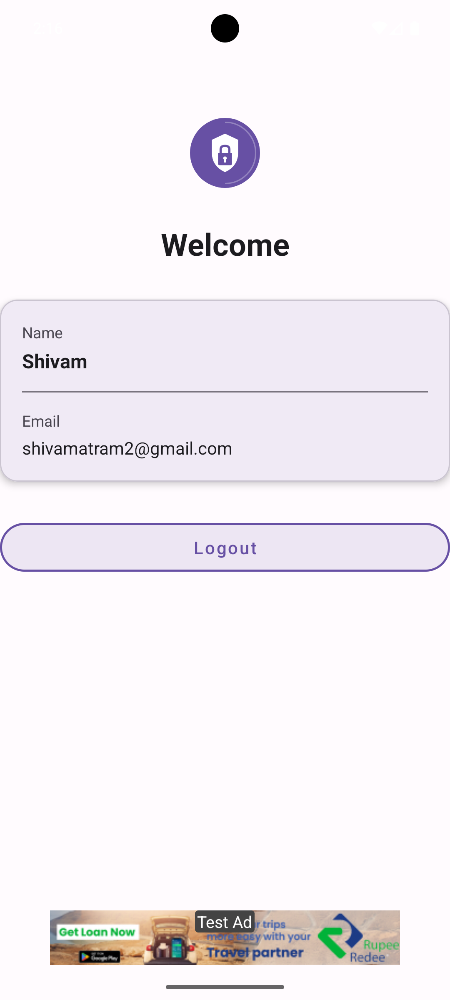

# AuthFlowApp

A production-ready Android authentication starter built with Kotlin, Firebase, and a clean, MVVM-ready architecture. Designed for real users, Play Store deployment, and as a portfolio-quality reference.

---

## 📌 Project Overview
- **Platform:** Android  
- **Language:** Kotlin  
- **Architecture:** Clean & scalable (MVVM-ready, separation of concerns)  
- **Backend:** Firebase (Auth + Realtime Database)  
- **Ads:** Google AdMob (Banner, test mode)  
- **UI:** Material Design with ViewBinding

---

## 🎯 Purpose
- Built to demonstrate a robust, real-world authentication flow suitable for any production app.  
- Shows how to wire Firebase Auth + Realtime Database with secure rules, session management, and polished UX.  
- Ready for real users and Play Store deployment: release build configs, privacy considerations, and AdMob in test mode.

---

## ✨ Features
- ✅ User signup with email & password
- ✅ Secure login via Firebase Authentication
- ✅ Forgot password via email reset link
- ✅ Session management (auto-login on app launch)
- ✅ Firebase Realtime Database user storage
- ✅ Secure database rules aligned to authenticated users
- ✅ Google AdMob banner ads (test mode)
- ✅ Material Design UI with ViewBinding
- ✅ Input validation and clear error handling
- ✅ Production-ready, MVVM-friendly architecture

---

## 🔄 App Workflow (Step-by-Step)

```
┌─────────────┐
│  App Launch │
└──────┬──────┘
       │
       ▼
┌─────────────────┐     Yes    ┌─────────────┐
│ Session Exists? │ ─────────► │ Main Screen │
└────────┬────────┘            └─────────────┘
         │ No
         ▼
┌─────────────┐
│ Login Screen│
└──────┬──────┘
       │
       ├─────────────────────────────┐
       ▼                             ▼
┌─────────────┐              ┌───────────────┐
│   Sign In   │              │ Forgot Pass   │
└──────┬──────┘              └───────┬───────┘
       │                             │
       ▼                             ▼
┌─────────────┐              ┌───────────────┐
│ Firebase    │              │ Send Reset    │
│ Auth Check  │              │ Email         │
└──────┬──────┘              └───────────────┘
       │
       ▼
┌─────────────┐
│ Main Screen │
└─────────────┘
```

1. **App launch → Session check:** Auto-detects existing Firebase user; routes to main screen if valid, else login.
2. **Login flow:** Validate inputs → Firebase sign-in → Save session state → Navigate to main.
3. **Signup flow:** Validate inputs → Firebase create user → Persist user profile in Realtime Database (`users/{uid}`) → Navigate to main.
4. **Firebase authentication:** Handles success/error paths with user-friendly messages.
5. **Realtime Database read/write:** On signup, writes user data; on main, reads profile securely.
6. **Forgot password:** Sends Firebase email reset link; communicates status to user.
7. **Main screen & logout:** Shows core UI, supports logout to clear session and return to login.
8. **AdMob banner lifecycle:** Load banner (test ad unit), display on main screen, pause/resume/destroy with activity lifecycle.

---

## 🛠 Tech Stack

| Layer | Technology | Purpose |
|-------|------------|---------|
| Language | Kotlin | Modern, concise Android development |
| Auth | Firebase Authentication | Email/Password sign-in & session |
| Database | Firebase Realtime Database | User profile storage |
| Ads | Google AdMob | Banner monetization (test mode) |
| UI Binding | ViewBinding | Type-safe view access |
| UI Design | Material Components | Modern, consistent UI |
| Architecture | MVVM-ready | Clean, scalable structure |

---

## 📂 Project Structure

```
AuthFlowApp/
├── app/
│   ├── src/
│   │   ├── main/
│   │   │   ├── java/com/shivam/authflowapp/
│   │   │   │   ├── activities/          # UI Activities
│   │   │   │   │   ├── LoginActivity.kt
│   │   │   │   │   ├── SignupActivity.kt
│   │   │   │   │   ├── MainActivity.kt
│   │   │   │   │   └── ForgotPasswordActivity.kt
│   │   │   │   ├── models/              # Data classes
│   │   │   │   │   └── User.kt
│   │   │   │   └── utils/               # Helper classes
│   │   │   │       └── ValidationUtils.kt
│   │   │   ├── res/
│   │   │   │   ├── layout/              # XML layouts
│   │   │   │   ├── values/              # Colors, strings, themes
│   │   │   │   └── drawable/            # Icons & backgrounds
│   │   │   └── AndroidManifest.xml
│   │   └── google-services.json         # Firebase config
│   ├── build.gradle.kts
│   └── proguard-rules.pro
├── firebase-database-rules.json         # Secure DB rules
├── gradle/
│   └── libs.versions.toml               # Version catalog
├── build.gradle.kts
└── settings.gradle.kts
```

---

## 🔐 Firebase Configuration

### Authentication Setup
1. Go to [Firebase Console](https://console.firebase.google.com/)
2. Create a new project or select existing
3. Navigate to **Authentication** → **Sign-in method**
4. Enable **Email/Password** provider

### Realtime Database Structure
```json
{
  "users": {
    "{uid}": {
      "name": "User Name",
      "email": "user@example.com",
      "createdAt": "timestamp"
    }
  }
}
```

### Security Rules
```json
{
  "rules": {
    "users": {
      "$uid": {
        ".read": "$uid === auth.uid",
        ".write": "$uid === auth.uid"
      }
    }
  }
}
```
> ⚠️ These rules ensure users can only read/write their own data.

---

## 📢 AdMob Integration

### Banner Ads Implementation
- Integrated using Google Mobile Ads SDK
- Uses **test ad unit IDs** during development
- Banner displayed on main screen

### Test Ad Unit IDs
```kotlin
// Banner Test ID (Google provided)
ca-app-pub-3940256099942544/6300978111
```

### Play Store Compliance
- ✅ Test ads used during development
- ✅ Replace with production IDs before release
- ✅ Follow [AdMob policies](https://support.google.com/admob/answer/6128543)
- ✅ Implement consent where required (GDPR/CCPA)

---

## 🚀 Getting Started

### Prerequisites
- Android Studio Giraffe (2023.1.1) or newer
- JDK 17+
- Firebase account
- Google AdMob account (optional)

### Installation

1. **Clone the repository**
   ```bash
   git clone https://github.com/yourusername/AuthFlowApp.git
   cd AuthFlowApp
   ```

2. **Open in Android Studio**
   ```
   File → Open → Select AuthFlowApp folder
   ```

3. **Configure Firebase**
   - Create project in [Firebase Console](https://console.firebase.google.com/)
   - Add Android app with package name
   - Download `google-services.json`
   - Place in `app/` directory

4. **Enable Authentication**
   - Firebase Console → Authentication → Sign-in method
   - Enable Email/Password

5. **Setup Realtime Database**
   - Firebase Console → Realtime Database → Create Database
   - Apply security rules from `firebase-database-rules.json`

6. **Sync & Run**
   ```
   Sync Gradle files → Run on device/emulator
   ```

---

## 🧪 Testing

### Authentication Tests
| Test Case | Steps | Expected Result |
|-----------|-------|-----------------|
| Signup | Enter valid email/password → Submit | Account created, navigate to main |
| Login | Enter credentials → Sign in | Authenticated, navigate to main |
| Invalid Email | Enter invalid format | Error message displayed |
| Weak Password | Enter < 6 characters | Error message displayed |
| Forgot Password | Enter email → Submit | Reset email sent |

### Session Tests
| Test Case | Steps | Expected Result |
|-----------|-------|-----------------|
| Auto-login | Close app → Reopen | Direct to main screen |
| Logout | Tap logout | Return to login screen |
| Session Clear | Logout → Reopen app | Show login screen |

---

## 📦 Play Store Readiness

### ✅ Security Checklist
- [x] Firebase rules restrict access per user UID
- [x] No public read/write access
- [x] Input validation on all forms
- [x] Secure password handling via Firebase

### ✅ Release Build
- [x] ProGuard/R8 configuration ready
- [x] Release signing configuration template
- [x] Minification enabled for release

### ✅ Compliance
- [x] AdMob test mode for development
- [x] Privacy Policy template included
- [x] GDPR-ready consent flow (optional)

### 📄 Required Documents
- [Privacy Policy](PRIVACY_POLICY.md)
- [Release Checklist](RELEASE_CHECKLIST.md)
- [AdMob Setup Guide](ADMOB_SETUP.md)

---

## 🖼 Screenshots

App screenshots (place images in the `screenshots/` folder). Use the exact filenames below so the gallery renders correctly on GitHub.

| Login | Signup | Forgot Password | Profile |
|:-----:|:------:|:---------------:|:------:|
|  |  |  |  |

**Expected filenames**
- `screenshots/login.png` — Login screen
- `screenshots/signup.png` — Create account screen
- `screenshots/forgot.png` — Forgot password screen
- `screenshots/profile.png` — Profile / welcome card (logout)

**Quick steps to add screenshots**
```bash
mkdir -p screenshots
# Save the images with the filenames above into the screenshots/ folder
# Then commit and push
git add screenshots/*
git commit -m "Add app screenshots"
git push
```

> 📸 If you prefer, add multiple image sizes (e.g. `-xxhdpi`) or include `screenshots/README.md` with caption details.

---

## 🤝 Contributing

Contributions are welcome! Please follow these steps:

1. Fork the repository
2. Create a feature branch (`git checkout -b feature/AmazingFeature`)
3. Commit changes (`git commit -m 'Add AmazingFeature'`)
4. Push to branch (`git push origin feature/AmazingFeature`)
5. Open a Pull Request

---

## 📜 License

```
MIT License

Copyright (c) 2026 Shivam Atram

Permission is hereby granted, free of charge, to any person obtaining a copy
of this software and associated documentation files (the "Software"), to deal
in the Software without restriction, including without limitation the rights
to use, copy, modify, merge, publish, distribute, sublicense, and/or sell
copies of the Software, and to permit persons to whom the Software is
furnished to do so, subject to the following conditions:

The above copyright notice and this permission notice shall be included in all
copies or substantial portions of the Software.

THE SOFTWARE IS PROVIDED "AS IS", WITHOUT WARRANTY OF ANY KIND, EXPRESS OR
IMPLIED, INCLUDING BUT NOT LIMITED TO THE WARRANTIES OF MERCHANTABILITY,
FITNESS FOR A PARTICULAR PURPOSE AND NONINFRINGEMENT. IN NO EVENT SHALL THE
AUTHORS OR COPYRIGHT HOLDERS BE LIABLE FOR ANY CLAIM, DAMAGES OR OTHER
LIABILITY, WHETHER IN AN ACTION OF CONTRACT, TORT OR OTHERWISE, ARISING FROM,
OUT OF OR IN CONNECTION WITH THE SOFTWARE OR THE USE OR OTHER DEALINGS IN THE
SOFTWARE.
```

---

## 👨‍💻 Author

<p align="center">
  <strong>Shivam Atram</strong><br>
  Android Developer<br><br>
  <a href="https://github.com/yourusername">GitHub</a> •
  <a href="https://linkedin.com/in/yourprofile">LinkedIn</a>
</p>

---

<p align="center">
  ⭐ Star this repo if you found it helpful!<br>
  Made with ❤️ for the Android community
</p>
